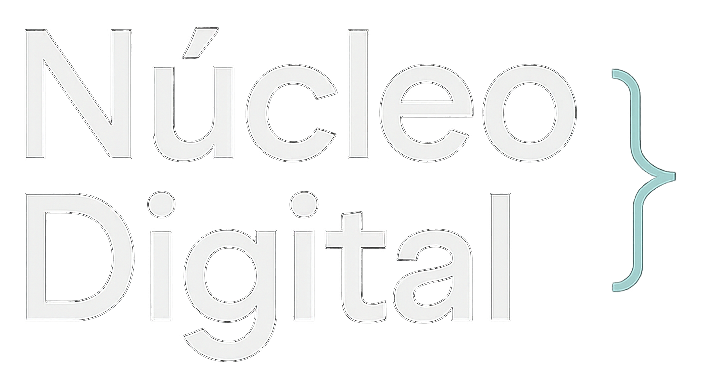
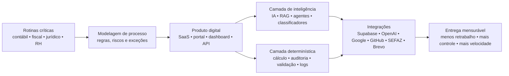
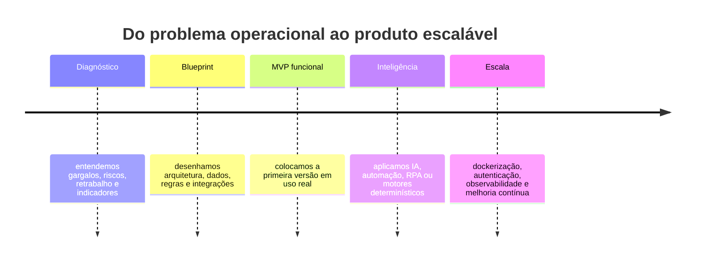

<!--
README de perfil para a organização/usuário GitHub: ndmg-dev
Coloque este arquivo em um repositório público chamado exatamente "ndmg-dev".
Estrutura esperada:
.
├── README.md
└── assets/
    └── logo-ndmg.png
-->

<p align="center">
  
</p>

<p align="center">
  
</p>

<p align="center">
  <a href="https://github.com/ndmg-dev">
    
  </a>
</p>

<p align="center">
  
  
  
  
  
</p>

---

## 🚀 O Núcleo

Somos o braço de tecnologia da **Mendonça Galvão**, criado para transformar conhecimento contábil, fiscal, societário e jurídico em **plataformas digitais de alta precisão**.

Não fazemos “sistemas por fazer”. Construímos produtos internos e SaaS com foco em **tempo operacional recuperado, redução de risco, rastreabilidade, inteligência aplicada e experiência premium**. Onde antes havia planilhas, retrabalho e decisões lentas, entregamos motores de cálculo, copilotos de IA, automações fiscais, RPA governamental, dashboards gerenciais e jornadas digitais completas.

> **Da rotina operacional ao produto escalável: software, IA e design trabalhando no mesmo fluxo.**

---

## 🧠 O que colocamos em produção

<table>
  <tr>
    <td width="50%">
      <h3>🤖 IA aplicada ao negócio</h3>
      <p>Copilotos, agentes, RAG, pipelines RAG-Free, análise de documentos, classificação semântica e geração assistida de relatórios para áreas contábeis, fiscais e jurídicas.</p>
    </td>
    <td width="50%">
      <h3>⚖️ Fiscal & Tributário</h3>
      <p>Motores determinísticos para ICMS, ST, Fronteira, precificação, auditoria de cálculo, importação de XML/ZIP de NF-e e relatórios com rastreabilidade.</p>
    </td>
  </tr>
  <tr>
    <td width="50%">
      <h3>📄 Legal & Societário</h3>
      <p>Análise inteligente de contratos, revisão de cláusulas, exportações em PDF/Word/Excel, fluxos de assinatura e automação de abertura de empresas.</p>
    </td>
    <td width="50%">
      <h3>🏢 Plataformas corporativas</h3>
      <p>Portais internos, RBAC, dashboards, workflows de tarefas, integrações com GitHub, Google, Supabase, APIs transacionais e mensageria omnichannel.</p>
    </td>
  </tr>
</table>

---

## 🧩 Stack com a qual operamos

<p align="center">
  
</p>

<table>
  <tr>
    <th align="left">Camada</th>
    <th align="left">Tecnologias e práticas</th>
  </tr>
  <tr>
    <td><strong>Frontend</strong></td>
    <td>React, Vite, TypeScript, Tailwind CSS, HTML5, CSS3, JavaScript, Jinja2, UI responsiva, glassmorphism, dark mode e dashboards orientados a KPI.</td>
  </tr>
  <tr>
    <td><strong>Backend</strong></td>
    <td>Python, FastAPI, Flask, Django, Uvicorn, SQLAlchemy, Alembic, Pydantic, APIs REST, arquitetura modular e validação forte de dados.</td>
  </tr>
  <tr>
    <td><strong>Dados & Auth</strong></td>
    <td>Supabase, PostgreSQL, Row Level Security, Storage, JWT/OAuth, Firebase Auth/Storage, SQLite local e isolamento multiempresa.</td>
  </tr>
  <tr>
    <td><strong>IA</strong></td>
    <td>OpenAI, GPT-4o, GPT-4o-mini, LangChain, LangGraph, RAG, RAG-Free, tool-calling, parsing documental, classificação e sumarização.</td>
  </tr>
  <tr>
    <td><strong>Automação</strong></td>
    <td>Playwright, RPA, webhooks, Google Calendar API, Brevo, Evolution API, ZapSign, GitHub API e integrações com portais externos.</td>
  </tr>
  <tr>
    <td><strong>DevOps</strong></td>
    <td>Docker, Docker Compose, GitHub Actions, Railway, Vercel, NGINX, ambientes versionados e deploys reproduzíveis.</td>
  </tr>
</table>

---

## 🏗️ Arquitetura mental do Núcleo Digital



---

## 🛰️ Soluções e produtos em destaque

<table>
  <tr>
    <td width="50%">
      <a href="https://github.com/ndmg-dev/CLAUSULA_AI">
        
      </a>
      <p><strong>Clausula AI</strong> — inteligência contratual para análise, auditoria, reescrita de cláusulas, exportações e add-in para Microsoft Word.</p>
    </td>
    <td width="50%">
      <a href="https://github.com/ndmg-dev/COPILOT_CONTABIL">
        
      </a>
      <p><strong>Copilot Contábil IA</strong> — SaaS com RAG, RAG-Free, análise de arquivos, base legal e automações omnichannel.</p>
    </td>
  </tr>
  <tr>
    <td width="50%">
      <a href="https://github.com/ndmg-dev/ATLAS_FISCAL">
        
      </a>
      <p><strong>ATLAS Fiscal</strong> — automação fiscal com ingestão de NF-e, motor ICMS-ST, precificação e RPA para rotinas governamentais.</p>
    </td>
    <td width="50%">
      <a href="https://github.com/ndmg-dev/ContAI_PRO">
        
      </a>
      <p><strong>ContAI PRO</strong> — conciliação financeira, parsing de documentos e classificação de plano de contas com IA semântica.</p>
    </td>
  </tr>
  <tr>
    <td width="50%">
      <a href="https://github.com/ndmg-dev/saas-fiscal">
        
      </a>
      <p><strong>SaaS Fiscal</strong> — precificação tributária com engine determinística, auditoria passo a passo, exportação Excel e KPIs visuais.</p>
    </td>
    <td width="50%">
      <a href="https://github.com/ndmg-dev/CalendarAI_PRO">
        
      </a>
      <p><strong>CalendAI PRO</strong> — agendamentos inteligentes com LangChain, Supabase, Google OAuth e sincronização com Google Calendar.</p>
    </td>
  </tr>
</table>

<details>
  <summary><strong>Ver mais frentes de desenvolvimento</strong></summary>

<br />

| Produto | Valor entregue | Stack dominante |
| --- | --- | --- |
| [Fiscal Fronteira](https://github.com/ndmg-dev/fiscal-fronteira) | Importação de NF-e, classificação fiscal, ICMS Fronteira/ST, memória de cálculo e XLSX para auditoria. | Django, PostgreSQL, Docker, Tabler UI |
| [ABRIR_EMPRESA](https://github.com/ndmg-dev/ABRIR_EMPRESA) | Wizard para abertura de empresas com upload documental, Supabase Storage e e-mails transacionais. | FastAPI, Supabase, Brevo, Railway |
| [Portal MG](https://github.com/ndmg-dev/portal-mg) | Hub corporativo para centralizar sistemas internos, acessos e jornadas de colaboradores. | Flask, HTML, CSS, JavaScript |
| [Task Controller](https://github.com/ndmg-dev/TASK_MANANGER) | Gestão de tarefas, Kanban, RBAC, revisão de código com IA e integração com GitHub. | React, Flask, Supabase, Groq AI |

</details>

---

## 📊 Pulso do desenvolvimento

<p align="center">
  
  
</p>

<p align="center">
  
</p>

---

## ✨ Nosso padrão de qualidade

<table>
  <tr>
    <td>🎯 <strong>Produto antes de tela</strong></td>
    <td>Mapeamos a dor operacional, desenhamos a jornada, validamos regras e só então codamos a interface.</td>
  </tr>
  <tr>
    <td>🧮 <strong>Precisão onde importa</strong></td>
    <td>Em cálculo fiscal e financeiro, usamos motores determinísticos, trilhas de auditoria e testes de fidelidade.</td>
  </tr>
  <tr>
    <td>🔐 <strong>Segurança por arquitetura</strong></td>
    <td>RBAC, RLS, JWT/OAuth, segregação multi-tenant e cuidado com chaves, storage e permissões.</td>
  </tr>
  <tr>
    <td>🧠 <strong>IA com contexto e limite</strong></td>
    <td>Aplicamos IA onde ela acelera decisão, leitura, classificação e criação — sem abrir mão de validações e logs.</td>
  </tr>
  <tr>
    <td>🪄 <strong>UX com refinamento</strong></td>
    <td>Dark mode, glassmorphism, microinterações, dashboards legíveis e interfaces que reduzem fricção real.</td>
  </tr>
</table>

---

## 🧭 Como transformamos uma dor em produto



---

## 🧪 Onde somos fortes

<p align="center">
  
  
  
  
  
  
  
  
  
  
  
  
</p>

---

## 💼 Posicionamento

O Núcleo Digital existe para uma tese simples:

> **empresas contábeis modernas não precisam apenas de sistemas; precisam de inteligência operacional codificada.**

Cada solução nasce conectada ao processo real, ao vocabulário do negócio e às métricas que importam para a operação. É assim que transformamos conhecimento técnico em vantagem competitiva: menos fricção, mais escala, mais governança e mais velocidade.

---

## 🐍 Animação de contribuições

Para habilitar a animação abaixo, crie um workflow no repositório de perfil gerando `output/snake.svg`.

<p align="center">
  <picture>
    <source media="(prefers-color-scheme: dark)" srcset="https://raw.githubusercontent.com/ndmg-dev/ndmg-dev/output/github-contribution-grid-snake-dark.svg" />
    <source media="(prefers-color-scheme: light)" srcset="https://raw.githubusercontent.com/ndmg-dev/ndmg-dev/output/github-contribution-grid-snake.svg" />
    
  </picture>
</p>

<details>
  <summary><strong>Workflow recomendado para gerar a animação snake</strong></summary>

Crie o arquivo `.github/workflows/snake.yml`:

```yaml
name: Generate contribution snake

on:
  schedule:
    - cron: "0 0 * * *"
  workflow_dispatch:

jobs:
  generate:
    permissions:
      contents: write
    runs-on: ubuntu-latest
    timeout-minutes: 5

    steps:
      - name: Generate snake animation
        uses: Platane/snk/svg-only@v3
        with:
          github_user_name: ndmg-dev
          outputs: |
            dist/github-contribution-grid-snake.svg
            dist/github-contribution-grid-snake-dark.svg?palette=github-dark

      - name: Push generated files
        uses: crazy-max/ghaction-github-pages@v4
        with:
          target_branch: output
          build_dir: dist
        env:
          GITHUB_TOKEN: ${{ secrets.GITHUB_TOKEN }}
```

</details>

---

<p align="center">
  
</p>

<p align="center">
  <strong>Núcleo Digital Mendonça Galvão</strong><br/>
  Software • IA • Automação • Dados • Experiência
</p>
